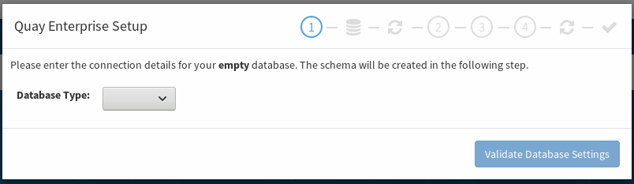

# Installing Quay

In this lab we will be going through installing Quay and it's prereqs. 


## Prerequisites


In the current release of Quay, you'll only be able to install on a project called `quay-enterprise`. This project needs to have `anyuid` capabilites. This means this entire workshop needs to be run as `system:admin`

```
oc login -u system:admin
```

Create the project `quay-enterprise` and give it access to run `anyuid` containers.

```
oc new-project quay-enterprise
oc adm policy add-scc-to-user anyuid -z default -n quay-enterprise
```

For ease of use, export your OpenShift's default route.

```
export ocproute=$(oc get routes -n default docker-registry -o jsonpath='{.spec.host}'  | cut -d'.' -f2-)
```

Download the installation/setup YAMLs. We will be using these for the installation.

```
cd ~
mkdir ./quaydeploy
cd ./quaydeploy
wget https://coreos.com/quay-enterprise/docs/latest/tectonic/files/quay-enterprise-namespace.yml
wget https://coreos.com/quay-enterprise/docs/latest/tectonic/files/quay-enterprise-config-secret.yml
wget https://coreos.com/quay-enterprise/docs/latest/tectonic/files/quay-enterprise-redis.yml
wget https://coreos.com/quay-enterprise/docs/latest/tectonic/files/quay-enterprise-app-rc.yml
wget https://coreos.com/quay-enterprise/docs/latest/tectonic/files/quay-enterprise-service-nodeport.yml
wget https://coreos.com/quay-enterprise/docs/latest/tectonic/files/quay-enterprise-service-loadbalancer.yml
wget https://coreos.com/quay-enterprise/docs/latest/tectonic/files/quay-servicetoken-role-k8s1-6.yaml
wget https://coreos.com/quay-enterprise/docs/latest/tectonic/files/quay-servicetoken-role-binding-k8s1-6.yaml
```

Make sure you have either `podman` or `docker` installed. If not, install it and verify it with the following command

```
docker version
```

You should switch to the  `quay-enterprise` project

```
$ oc project quay-enterprise
```

## Deploying Quay

In order to deploy Quay, you'll need access to the container images via a docker config file. You can get one by simply running `docker login` against the quay.io registry. You can get the login command from [this kbase article](https://access.redhat.com/solutions/3533201)

Copy the command from the KBASE article above ^ in the terminal

```
docker login -u="coreos+rhcp" -p="[ GET THIS PART FORM THE KBASE ARTICLE ABOVE ^^^^^^^ ]"  quay.io
```

This should create/update the `~/.docker/config.json` file

```
$ ls -ld ~/.docker/config.json
-rw-------. 1 ec2-user ec2-user 400 Jan 15 00:19 /home/ec2-user/.docker/config.json
```

Copy this file to the `quaydeploy` working directory

```
$ cp ~/.docker/config.json ~/quaydeploy/
```

Once you have this file, upload it to OpenShift and create the config secret

```
oc create -f quay-enterprise-config-secret.yml
oc create secret generic coreos-pull-secret \
--from-file=".dockerconfigjson=config.json" --type='kubernetes.io/dockerconfigjson' -n quay-enterprise
```

Now you have to create the role and it's corresponding bindings (you must run this as `system:admin`). You have to add `anyuid` to this new role.

```
oc create -f quay-servicetoken-role-k8s1-6.yaml -n quay-enterprise
oc create -f quay-servicetoken-role-binding-k8s1-6.yaml -n quay-enterprise
oc adm policy add-scc-to-user anyuid system:serviceaccount:quay-enterpriseefault
```

You are now ready to deploy Redis and Quay.

```
oc create -f quay-enterprise-redis.yml
oc create -f quay-enterprise-app-rc.yml -f quay-enterprise-service-loadbalancer.yml
```

Expose the route.

```
oc expose svc quay-enterprise --name=quay --hostname=quay.${ocproute}
```

If you visit this URL, you'll see something like this...



That means it's up and running! Before we set this up; we'll have to deploy a database first.

## Deploying A Database

Quay supports mysql/mariadb and postgresql. We will be deploying a postgresql db, since clair (the image scanning tool) uses pgsql. Ideally, in a production installation, this would be handeled by your DBA. But for the purposes of this workshop, we'll spin one up.

Make sure you're still the the `quay-enterprise` namespace.

```
oc project quay-enterprise
```

Use the postgresql template with persistant storage

```
oc new-app --name=postgresql -l app=postgresql --template=postgresql-persistent \
--param=POSTGRESQL_USER=quay --param=POSTGRESQL_PASSWORD=quay --param=POSTGRESQL_DATABASE=quay
```

Once the postgresql pod is up, run an `oc rsh` to login to the pod. We will set it up from within the pod.

```
oc rsh $(oc get pods -l app=postgresql -o jsonpath='{.items[*].metadata.name}')
```

Once inside this pod, verify that the admin pack is installed

```
sh-4.2$  echo "SELECT * FROM pg_available_extensions" | /opt/rh/rh-postgresql96/root/usr/bin/psql | grep admin
 adminpack          | 1.1             |                   | administrative functions for PostgreSQL
```

Next, we create the `pg_trgm` extention

```
sh-4.2$ echo "CREATE EXTENSION pg_trgm" | /opt/rh/rh-postgresql96/root/usr/bin/psql
CREATE EXTENSION
```

Now, make the `quay` user, an admin

```
sh-4.2$ echo "ALTER USER quay WITH SUPERUSER;" | /opt/rh/rh-postgresql96/root/usr/bin/psql
ALTER ROLE
```

Finally, since we're here, let's create the `clair` database to use later in this workshop


```
sh-4.2$  echo "create database clair;" | /opt/rh/rh-postgresql96/root/usr/bin/psql
CREATE DATABASE
```

You can exit the pod

```
sh-4.2$ exit
```

Database is ready to go!

## Deploying Object Storage

Quay, for production use, needs to use object storage. We will be deploying minio for object storage. Minio is an S3 compatiable Object Storage that runs inside Kubernetes. For more information you can visit [minio's website](https://www.minio.io/kubernetes.html).

If you already have Object storage in place or if you're planning on using cloud based object storage (like S3); you can skip this section.

For those of us who need it, let's get it deployed!

First download the template from this repo

```
wget https://raw.githubusercontent.com/RedHatWorkshops/quay-on-openshift/master/labs/resources/minio-deployment-TEMPLATE.yaml
```

Next, export something for the access key and secret key (you can generate these randomly)

```
export MINIO_ACCESS_KEY=$(cat /dev/urandom | LC_ALL=C tr -dc 'A-Z0-9' | fold -w 20 | head -1)
export MINIO_SECRET_KEY=$(cat /dev/urandom | LC_ALL=C tr -dc 'a-zA-Z0-9' | fold -w 40 | head -1)
```

Use `envsubst` to replace these values from the template

```
envsubst < minio-deployment-TEMPLATE.yaml  > minio-deployment.yaml
```

Verify that the values got replaced

```
$ grep -A1 MINIO minio-deployment.yaml
        - name: MINIO_ACCESS_KEY
          value: "OXZFISM5BZZZZA77UZ9N"
        - name: MINIO_SECRET_KEY
          value: "WxgZlbN4GlX5MKcZZZVyOBtbP4VDwUPMR8lWw9ki"
```

Deploy minio using the newly created yaml

```
oc create -f minio-deployment.yaml
```

Create a route for `minio`

```
oc expose svc minio-service --name=minio --hostname=minio.${ocproute}
```

Download the [minio client](https://dl.minio.io/client/mc/release/) and put it in your path

```
sudo wget https://dl.minio.io/client/mc/release/linux-amd64/mc -O /usr/local/bin/mc
sudo chmod +x /usr/local/bin/mc
```

Create a bucket where quay can store the images

```
mc config host add minio http://minio.${ocproute} ${MINIO_ACCESS_KEY} ${MINIO_SECRET_KEY}
mc mb minio/quay
```

Verify the bucket has been created with

```
mc ls minio
```

That's it! You've installed quay and you may now move on to [Configuring Quay](1.configurequay.md)
