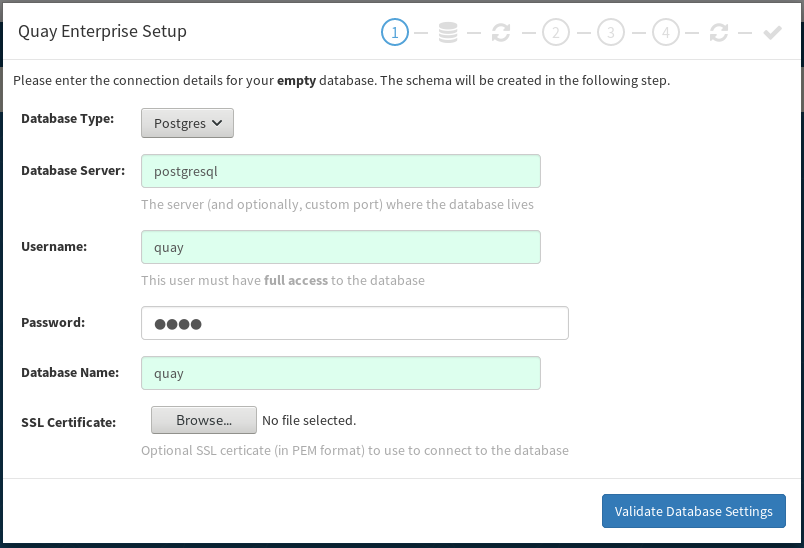
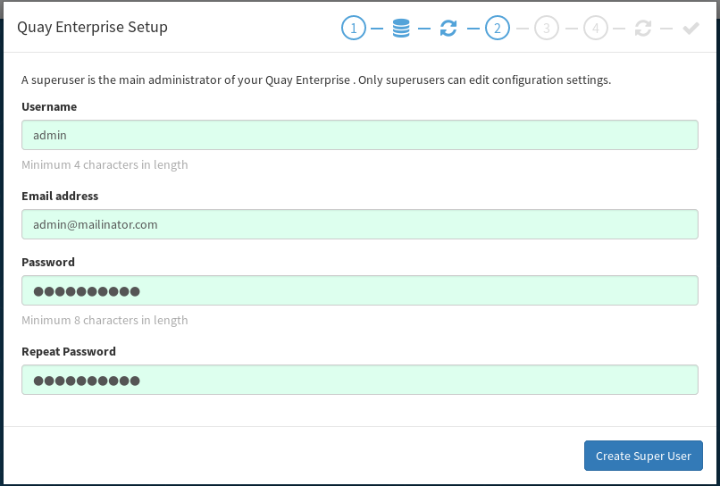
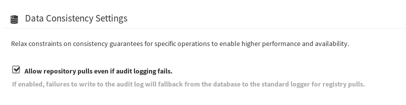
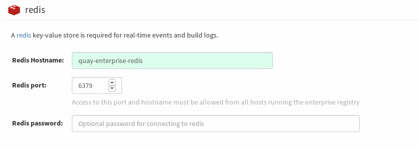
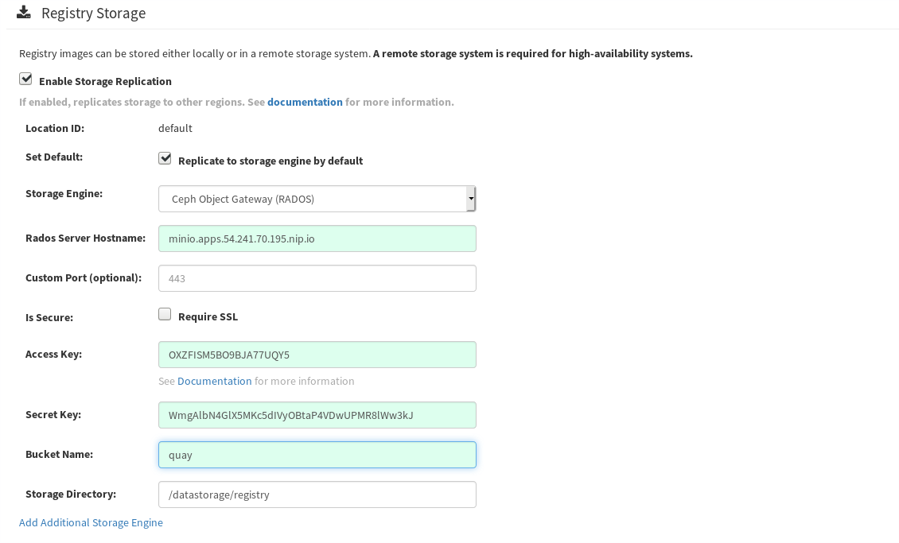
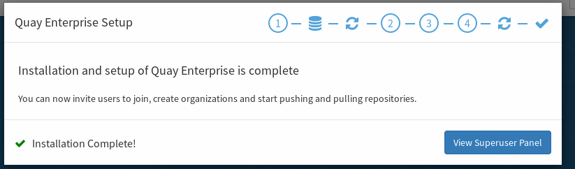
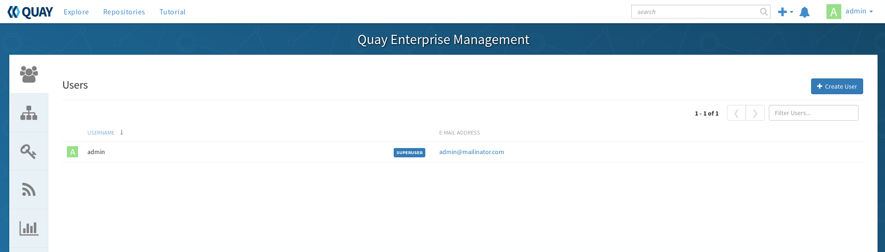

# Configure Quay

Now that you have your prereqs deployed; you can go ahead and configure quay now. You can do this by visiting the setup page on your web browser. Open up the URL set by the route

```
firefox http://quay.${ocproute}
```

First, it'll ask you to fill in your database connection. Choose `Postgres` and fill the rest out.



If you're following along; the values should be...

* `Database Server` - This should be set to `postgresql` (i.e. the service name of the db)
* `Username` - This should be set to `quay` (this was set in the pgsql deployment)
* `Password` - This should be set to `quay` (this was also set in the pgsql deployment)
* `Database Name` - This should be set to `quay` (this was, again, also set in the pgsql deployment)
* `SSL Certificate` -  leave blank

Click on `Validate Database Settings` and quay will set up the database for you. Once it's done you'll see this screen


Click on "Restart Container"...this will kill the quay process which will trigger k8s to restart the container. (**NOTE** you may need to referesh the page a few times)

Once the database is set up (and you've refreshed the page), the installer will ask you to create an admin account.



Once you've filled out this form, click `Create Super User` (**NOTE** You might get an error that says "unable to create super user"...this is because your session expired...reload the page and it'll let you log back in)

Now that the container has restarted; We'll configure some settings to finish up the installation.

First, tick off "Allow repository pulls even if audit logging fails."



Next, set up the redis connection. The `Redis Hostname` can be found by running `oc get svc | grep redis`. By default it should be `quay-enterprise-redis` with the port of `6379`. It should look something like this



Next, configure Registry storage. Tick off `Enable Storage Replication` and fill out the rest based on your `minio` installation. It should look something like this (explanation below)



* `Set Default` - Tick off `Replicate to storage engine by default `
* `Storage Engine` -  Select `Ceph Object Gateway (RADOS)` from the dropdown
* `Rados Server Hostname` -  Enter the output of `oc get routes minio`
* `Access Key` - Get this from the output of `oc set env deployment/minio-deployment --list`
* `Secret Key` - You can get this also from the output of `oc set env deployment/minio-deployment --list`
* `Bucket Name` -  Set this to `quay` (if unsure, run `mc ls minio`)

Everything else is left as the default or blank.

Scroll down and select "Save Configuration" on the lower left hand side. Once saved it will ask you to restart the container. Restart the container and refresh your browser a few times.

Once completed; you'll see the following image. Click on "View Super User Panel"



Once you see this page, you're done!



You can continue to the next lab [Installing Clair](2.installingclair.md)
