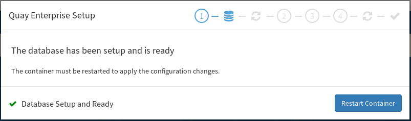

# Configure Quay

Now that you have your prereqs deployed; you can go ahead and configure quay now. You can do this by visiting the setup page on your web browser. Open up the URL set by the route

```
firefox http://quay.${ocproute}
```

First, it'll ask you to fill in your database connection. Choose `Postgres` and fill the rest out.


If you're following along; the values should be...

* `Database Server` - This should be set to `postgresql` (i.e. the service name of the db)
* `Username` - This should be set to `quay` (this was set in the pgsql deployment)
* `Password` - This should be set to `quay` (this was also set in the pgsql deployment)
* `Database Name` - This should be set to `quay` (this was, again, also set in the pgsql deployment)
* `SSL Certificate` -  leave blank

Click on `Validate Database Settings` and quay will set up the database for you. Once it's done you'll see this screen



Click on "Restart Container"...this will kill the quay process which will trigger k8s to restart the container. (**NOTE** you may need to referesh the page a few times)

Once the database is set up (and you've refreshed the page), the installer will ask you to create an admin account.


Once you've filled out this form, click `Create Super User` (**NOTE** You might get an error that says "unable to create super user"...this is because your session expired...reload the page and it'll let you log back in)
