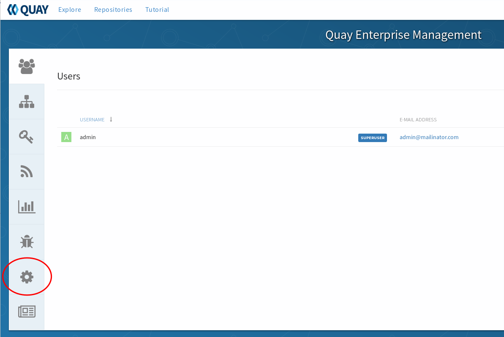
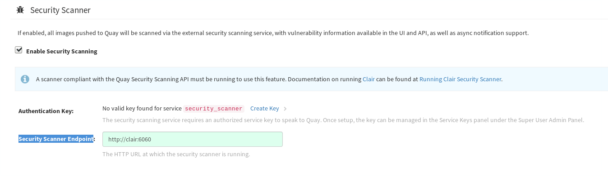

# Installing Clair

Clair is an open source project for the static analysis of vulnerabilities in `appc` and `docker` containers. It's the default scanner for `quay`. 

Vulnerability data is continuously imported from a known set of sources and correlated with the indexed contents of container images in order to produce lists of vulnerabilities that threaten a container.

The following sections explain how to set up clair and connect it to quay.

## Set Up Quay

Under the admin panel, click on the gear icon to the left to reach the "Registry Settngs"

Once here scroll down until you see `Security Scanner` and tick off `Enable Security Scanning`. In the `Security Scanner Endpoint` enter `http://clair:6060`. It should look like this.

To connect Quay Enterprise securely to the scanner, click `Create Key >` to create an authentication key between Quay and the Security Scanner. This will bring up a window, select `Generate shared key`

Enter an optional expiration date, and click `Generate Key`

**Save the key ID** and download the preshared private key into your `$HOME` directory.

