# Creatings Users and Organizations

In this Lab we will be creating a user and an organization.

Organizations provide a way of sharing repositories under a common namespace that does not belong to a single user, but rather to many users in a shared setting (such as a company).

Organizations are further broken down into a set of Teams which provide access to a subset of the repositories under that namespace


# Creating A User

Open up the 


```
firefox http://quay.${ocproute}/superuser/
```


This should bring up the Admin console and the "users" tab should already be selected. The screen should look like this

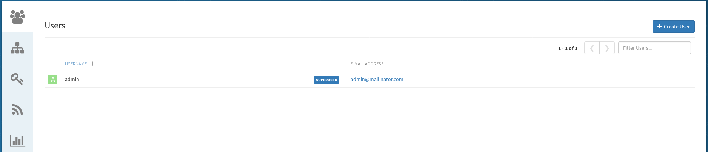


On the top right hand side, click on `Create User` button. This will bring up the `Create New User` page.

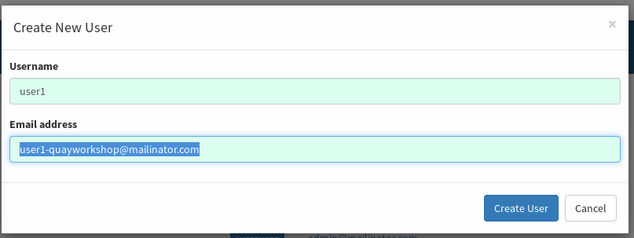


In this dialog box, enter...

* `Username` - Enter `user1`
* `Email address` - Enter `user1-quayworkshop@mailinator.com`

Click on `Create User` button when done.

This will bring up a screen that shows the temporary password

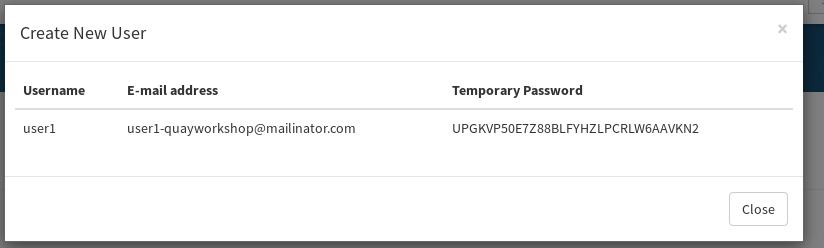

Make note of this password and click `Close`

Now signout by clicking the top right and selecting `Sign out all sessions`

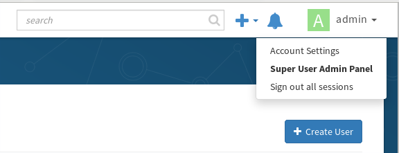

Now at the signin screen, enter the username/temp-password combo you just created

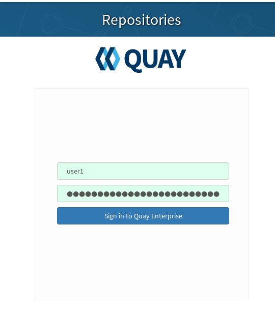


On the top right click the username and select `Account Settings` this should bring you to the `User Settings` page.

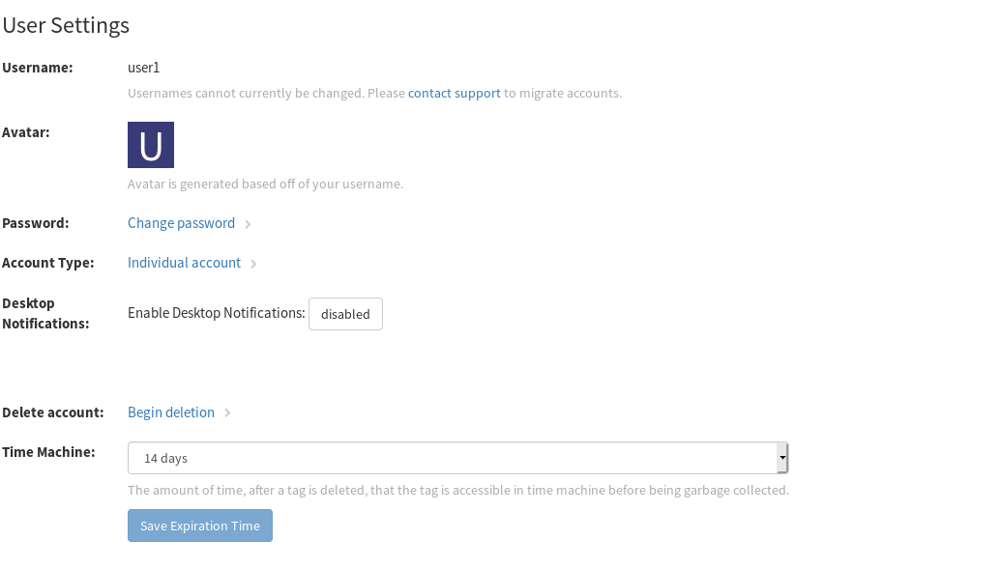


Click on `Change password` and enter a new password and click the `Change Password`

You've successfully created a new user!

## Organizations

To create an organization login into Quay with `user1`

```
firefox http://quay.${ocproute}/superuser/
```
Once you're logged in, you'll be greated with the following screen

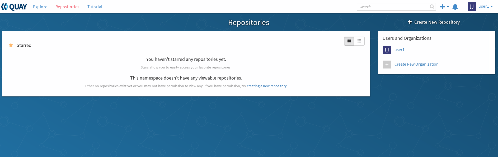

On the right hand side, click `Create New Oragnization`

In the next screen enter a name for this organization; I used `marketing` as an example

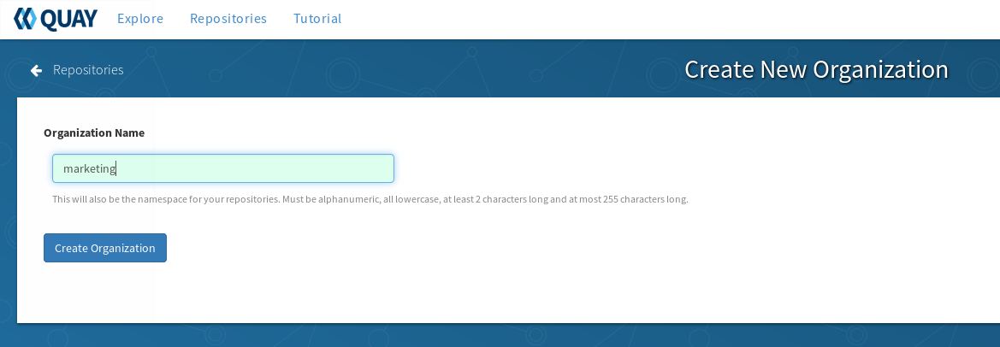

Click `Create Organization` to create it.

Once created; it'll drop you into the Organization Settings page

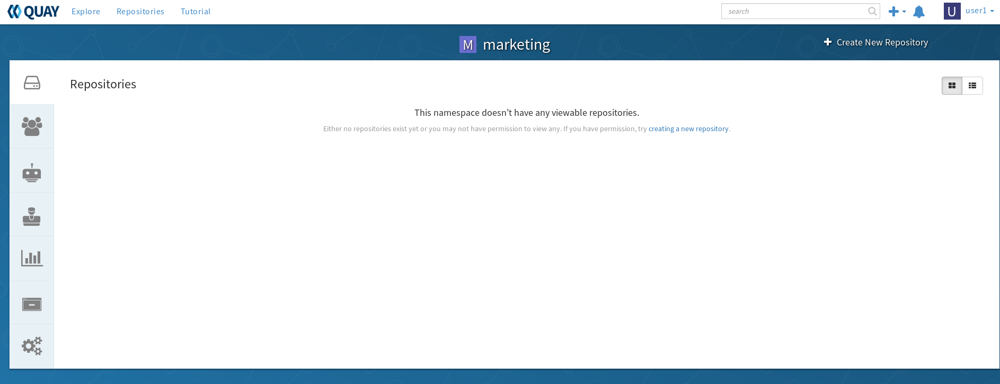

Now that you have a organization...it's time to create a team!


## Create a Team

While still on the Organization overview page, click on the "Teams and Memebership" logo  on the left hand side to bring up the overview page.

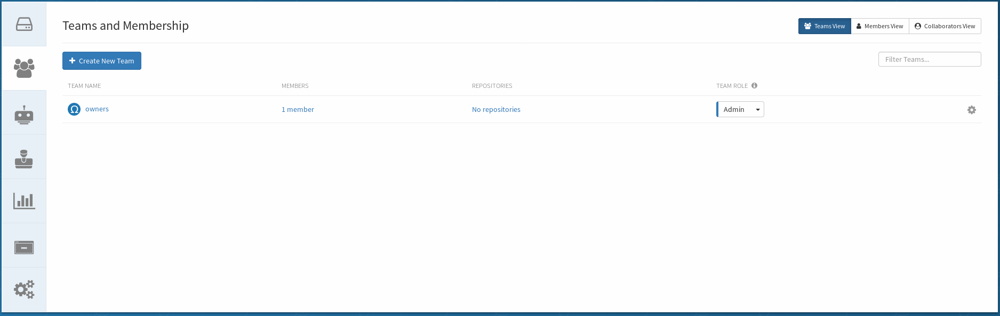

Click on `Create New Team` and give it a name. I will use `developers`

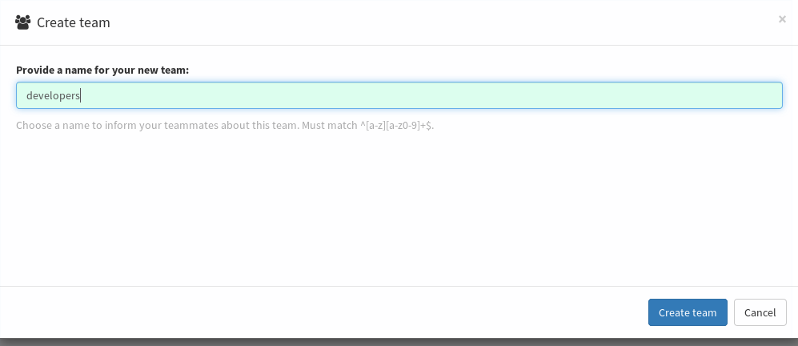

Once you've filled out the name, click on `Create team`

That's it! You can go ahead to [Pushing and Pulling images](4.pushingandpulling.md)

