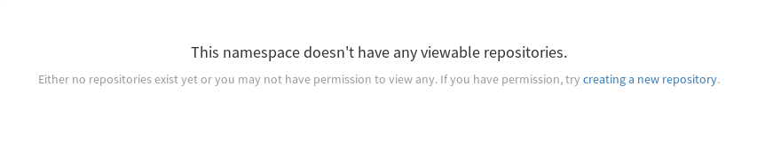

# Pushing and Pulling Images

Now that you have a user with an organization in place; you can now push and pull in to this repo. You can also manages who has access to what repo based on the teams in your organization.

## Creating a Repository

First thing you have to do is login to this new repo.

```
firefox http://quay.${ocproute}/repository
```

Once logged in, click on the right had side on your organization, in my case, I clicked on `marketing`


On this page it will say `This namespace doesn't have any viewable repositories.`. Click on `creating a new repository`



Once you've clicked that, you'll see the `Create New Repository` page. Here fill in the name as `welcome-php` and leave the access as `Private` (which is the default if you're doing it from the command line). It should look like this...


Now click on `Create Private Repository`

## Push an Image to the repo

For this section, I will be pulling an image from the hostend Quay and then pushing it into this private instance. I will be using `podman` but the same commands will work if you're using docker


***NOTE*** You need to add your quay's domain name as an insecure registry. (This process may differ depending on what you're running on your client.

For example
```
$ sudo grep -B1 quay /etc/containers/registries.conf
[registries.insecure]
registries = ['quay.apps.54.241.70.195.nip.io']
```

Once you've gotten that set up, pull the `quay.io/redhatworkshops/welcome-php` image to your local machine.

```
$ podman pull quay.io/redhatworkshops/welcome-php
Trying to pull quay.io/redhatworkshops/welcome-php...Getting image source signatures
Copying blob sha256:92058cf44053377a006500dd6593e87ff8ca67dc664f49a7a55b1dcda11af599
 71.48 MB / 71.48 MB [======================================================] 3s
Copying blob sha256:8d846904080d377a49f8b4b1ab24c51e85ab24417ff494bb6cb986aaa7df3134
 1.25 KB / 1.25 KB [========================================================] 0s
Copying blob sha256:89518257a7daa63c87cdd9cb2085f709cd73747549ac48561a3dd0059021f1e5
 6.39 MB / 6.39 MB [========================================================] 0s
Copying blob sha256:061b2d93ca071f14e1d4b0bfa35b131b72b3aaae215f829c099aa2ad689c3b82
 79.78 MB / 79.78 MB [======================================================] 3s
Copying blob sha256:a6219b80903c6c4c25a32a4506d817efe15beac3028533fe47e4af871696202a
 43.16 MB / 43.16 MB [======================================================] 1s
Copying blob sha256:95b7cb38207ae46872653e4f8e7f5379f263b8290dd3ebbb564569ed4f1b18cb
 243.46 KB / 243.46 KB [====================================================] 0s
Writing manifest to image destination
```

Now  check to see if you have the image locally...it should look like this

```
$ podman images
REPOSITORY                            TAG      IMAGE ID       CREATED       SIZE
quay.io/redhatworkshops/welcome-php   latest   b57beebcb38c   5 weeks ago   592 MB
```

Now login to your Quay instance using the cli as `user1` (the user who has access to the `marketing` org)

```
$ podman login quay.${ocproute}
Username: user1
Password: *******
Login Succeeded!
```

Now tag the image to prepare it to be pushed/uploaded...

```
podman tag quay.io/redhatworkshops/welcome-php:latest quay.${ocproute}/marketing/welcome-php:latest
```

Now push this up to your instance

```
$ podman push quay.${ocproute}/marketing/welcome-php:latest
Getting image source signatures
Copying blob sha256:20a1b4e9f75b380b79e95e10028abbc659d9e2da4f4c3e0d17b1dd2ae37fd717
 200.91 MB / 200.91 MB [===================================================] 27s
Copying blob sha256:8a325f8a1c47d5ebed8a831dc6059cd844fa786437f0eba44a6e4127edb74d7f
 10.00 KB / 10.00 KB [======================================================] 0s
Copying blob sha256:21c4b876b68b4ecedb708c6434c66ef4df000bef55252f283cfb5be29b1a2e17
 20.18 MB / 20.18 MB [======================================================] 2s
Copying blob sha256:cd8f678e75d4c7b1ff3e69b315d8b4fd391d2be527717a958627f81ecaf850c7
 238.60 MB / 238.60 MB [===================================================] 32s
Copying blob sha256:95eeb452da25fb3ff40d7b6f5fb1b2d7ece2f2e2a37942c1666546678ee8025d
 104.59 MB / 104.59 MB [===================================================] 17s
Copying blob sha256:de821eccf491b687d8a1d91b046a6abca476e1172b7677e58dda45fab4d46ab5
 469.00 KB / 469.00 KB [====================================================] 0s
Writing manifest to image destination
Storing signatures
```

You've successfully pushed an image into your quay instance!

## Pull an Image from the repo

To test this, we will first delete the images (**WARNING** the following command will delete ALL your local images...use with caution)

```
podman rmi --force $(podman images -q)
```

Also logout of your instance

```
podman logout quay.${ocproute}
```

You should now not have the `welcome-php` in your local machine

```
$ podman images
$ podman ps
CONTAINER ID  IMAGE  COMMAND  CREATED  STATUS  PORTS  NAMES
```

Try pulling the image...you should see an `unauthorized` error message

```
$ podman pull quay.${ocproute}/marketing/welcome-php:latest
Trying to pull quay.apps.54.241.70.195.nip.io/marketing/welcome-php:latest...Failed
error pulling image "quay.apps.54.241.70.195.nip.io/marketing/welcome-php:latest": unable to pull quay.apps.54.241.70.195.nip.io/marketing/welcome-php:latest: unable to pull image: Error determining manifest MIME type for docker://quay.apps.54.241.70.195.nip.io/marketing/welcome-php:latest: Error reading manifest latest in quay.apps.54.241.70.195.nip.io/marketing/welcome-php: unauthorized: access to the requested resource is not authorized
```

Now login as `user1`

```
$ podman login -u user1 quay.${ocproute}
Password:
Login Succeeded!
```

You should be now be able to pull the image

```
$ podman pull quay.${ocproute}/marketing/welcome-php:latest
Trying to pull quay.apps.54.241.70.195.nip.io/marketing/welcome-php:latest...Getting image source signatures
Copying blob sha256:92058cf44053377a006500dd6593e87ff8ca67dc664f49a7a55b1dcda11af599
 71.48 MB / 71.48 MB [======================================================] 6s
Copying blob sha256:8d846904080d377a49f8b4b1ab24c51e85ab24417ff494bb6cb986aaa7df3134
 1.25 KB / 1.25 KB [========================================================] 0s
Copying blob sha256:89518257a7daa63c87cdd9cb2085f709cd73747549ac48561a3dd0059021f1e5
 6.39 MB / 6.39 MB [========================================================] 0s
Copying blob sha256:061b2d93ca071f14e1d4b0bfa35b131b72b3aaae215f829c099aa2ad689c3b82
 79.78 MB / 79.78 MB [======================================================] 4s
Copying blob sha256:a6219b80903c6c4c25a32a4506d817efe15beac3028533fe47e4af871696202a
 43.16 MB / 43.16 MB [======================================================] 2s
Copying blob sha256:95b7cb38207ae46872653e4f8e7f5379f263b8290dd3ebbb564569ed4f1b18cb
 243.46 KB / 243.46 KB [====================================================] 0s
Writing manifest to image destination
Storing signatures
b57beebcb38c0c390a9da77aca0485f4d420bff1aaacea1ccf29ec36d1adabc2
```

You should have your image now locally

```
$ podman images
REPOSITORY                                             TAG      IMAGE ID       CREATED       SIZE
quay.apps.54.241.70.195.nip.io/marketing/welcome-php   latest   b57beebcb38c   5 weeks ago   592 MB
```

## Verifying Clair scan

Clair, by default, scans all images for vulnerabilites. This is queued up as soon as the push finishes. Open up your browser to the `marketing` organization and login as `user1`

```
firefox quay.${ocproute}/organization/marketing
```

Once logged in, you should see this page


Once you're here click on the `welcome-php` repo you just pushed into.


On this page click on the tag icon  on the left hand side. This will bring up the tag overview page. Here you can see the image has been scanned and issues have been found. 


Click on the `12 high` (number might differ on yours) link to see an overview page. Feel free to browse around and see the issues and their fixes.


That's it! you can continue on to [Assigning Users to Teams](5.userstoteams.md)

