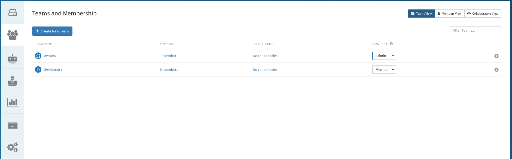
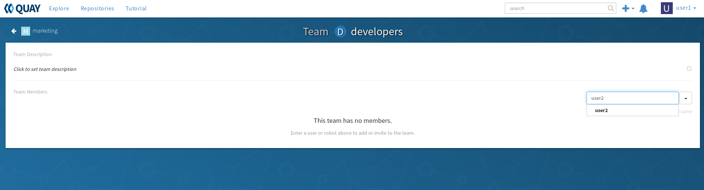
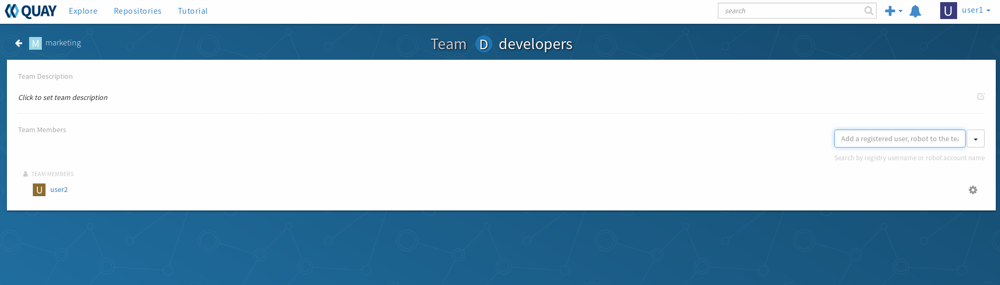
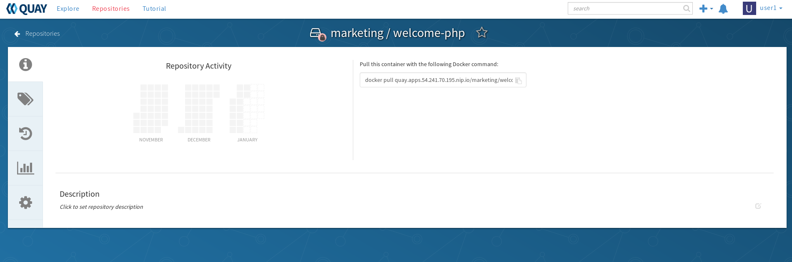
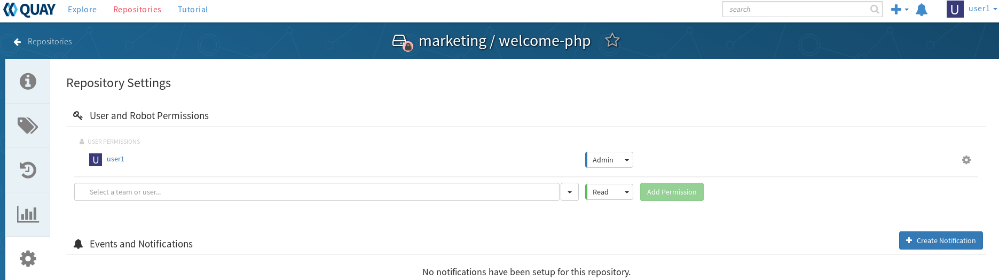

# Assinging Users to Teams

In this lab you'll assign users to teams and then set permissions on the team to see it in action.

## Create User

Use the skills you learned in [Creatings Users and Organizations](labs/3.usersandorgs.md) to create a user as the `admin` user.

* Name this user `user2`
* Login as `user2` using the temp password
* Change the password of `user2`


Verify that this user CANNOT pull the `welcome-php` image from the `marketing` organization/namespace

Login

```
$ podman login -u user2 quay.${ocproute}
Password: ********
Login Succeeded!
```

Try and pull the image (this should fail)

```
$ podman pull quay.${ocproute}/marketing/welcome-php:latest
Trying to pull quay.apps.54.241.70.195.nip.io/marketing/welcome-php:latest...Failed
error pulling image "quay.apps.54.241.70.195.nip.io/marketing/welcome-php:latest": unable to pull quay.apps.54.241.70.195.nip.io/marketing/welcome-php:latest: unable to pull image: Error determining manifest MIME type for docker://quay.apps.54.241.70.195.nip.io/marketing/welcome-php:latest: Error reading manifest latest in quay.apps.54.241.70.195.nip.io/marketing/welcome-php: unauthorized: access to the requested resource is not authorized
```

Once this is done move on to the next section

## Assign user to a Team

Log out of any session you may be in an relaunch the web UI to the marketing organization

```
firefox quay.${ocproute}/organization/marketing
```

Here you should see the overview page for the `marketing` org


Click on the `Teams and Membership` icon  to take you to the overview page. It should look like this



Click on the `developers` team and on the next page; on the left hand side, type `user2`. It should find the user in the drop down



Click that drop down user to add them to this team...it should look like this



## Set Permissions

Now we need to set the permissions to the repo. As `user1` login to quay and navigate to the `welcome-php` image

```
firefox quay.${ocproute}/repository/marketing/welcome-php
```



Here click on the gear  icon and it'll take you to the settings page for this image



Under `User and Robot Permissions` click the down arrow and choose the `developer` team. Then choose `Read` and their permission. It should look something like this


Click `Add Premission` (to the right in green) to set the permission

## Verify Access

Now back on the cli, make sure you're logged into the registry as `user2`

```
$ podman login -u user2 quay.${ocproute}
Password: ********
Login Succeeded!
```

You should now be able to pull the image

```
$ podman pull quay.${ocproute}/marketing/welcome-php:latest
Trying to pull quay.apps.54.241.70.195.nip.io/marketing/welcome-php:latest...Getting image source signatures
Skipping fetch of repeat blob sha256:92058cf44053377a006500dd6593e87ff8ca67dc664f49a7a55b1dcda11af599
Skipping fetch of repeat blob sha256:8d846904080d377a49f8b4b1ab24c51e85ab24417ff494bb6cb986aaa7df3134
Skipping fetch of repeat blob sha256:89518257a7daa63c87cdd9cb2085f709cd73747549ac48561a3dd0059021f1e5
Skipping fetch of repeat blob sha256:061b2d93ca071f14e1d4b0bfa35b131b72b3aaae215f829c099aa2ad689c3b82
Skipping fetch of repeat blob sha256:a6219b80903c6c4c25a32a4506d817efe15beac3028533fe47e4af871696202a
Skipping fetch of repeat blob sha256:95b7cb38207ae46872653e4f8e7f5379f263b8290dd3ebbb564569ed4f1b18cb
Writing manifest to image destination
Storing signatures
b57beebcb38c0c390a9da77aca0485f4d420bff1aaacea1ccf29ec36d1adabc2
```

You should only have the ability to read ("pull") that image. Let's test this by trying to update it

First, pull an image that is different

```
$ podman pull centos/httpd-24-centos7
Trying to pull docker.io/centos/httpd-24-centos7:latest...Getting image source signatures
Copying blob sha256:a02a4930cb5d36f3290eb84f4bfa30668ef2e9fe3a1fb73ec015fc58b9958b17
 71.68 MB / 71.68 MB [======================================================] 2s
Copying blob sha256:70cd6e3d07d1e04c76ab381733edeb047304201da2e787a54169487fc50df42e
 9.22 MB / 9.22 MB [========================================================] 0s
Copying blob sha256:223ac6fd4e5e8b913bd473593d40f0a0ab4c61122f9334e119737ddb545b1ef0
 4.63 KB / 4.63 KB [========================================================] 0s
Copying blob sha256:dccd6afbeb2dbebdc2121a050fa7e164c8994b79229bcfe711c1adc4e4079ecd
 195.68 KB / 195.68 KB [====================================================] 0s
Copying blob sha256:f1c7f01221e674b65bd37a23d89050db5faae40cd69c2fd607829e759955792d
 52.38 MB / 52.38 MB [======================================================] 1s
Copying blob sha256:94c580dd40e908fe5d53db37058c40ca880330e7c96e85f40546de83a1ea9b58
 845 B / 845 B [============================================================] 0s
Copying blob sha256:006bfc819f0373f8b126adc39bca7b2845999a0339305ade38be5ff29ae8dd7c
 6.00 KB / 6.00 KB [========================================================] 0s
Copying blob sha256:8c46819055b94b401dbea43e7729d890b0e6a340362ffb0c1631994eee061e30
 218.05 KB / 218.05 KB [====================================================] 0s
Copying config sha256:7cbb1484f52d6d77e192bf16771d2064151d6cebb76c59e292edf316c0940397
 15.38 KB / 15.38 KB [======================================================] 0s
Writing manifest to image destination
Storing signatures
7cbb1484f52d6d77e192bf16771d2064151d6cebb76c59e292edf316c0940397
```

Tag this new image to `welcome-php` (staging it so it will be overwritten)

```
podman tag docker.io/centos/httpd-24-centos7:latest quay.${ocproute}/marketing/welcome-php:latest
```

When you run a `push` operation, it will fail since the team `developers` (that `user2` is a part of) only has read (or "pull") access.

```
$ podman push quay.${ocproute}/marketing/welcome-php:latest
Getting image source signatures
Copying blob sha256:071d8bd765171080d01682844524be57ac9883e53079b6ac66707e192ea25956
 8 B / 200.44 MB [>---------------------------------------------------------] 0s
Error copying image to the remote destination: Error writing blob: Error initiating layer upload to /v2/marketing/welcome-php/blobs/uploads/ in quay.apps.54.241.70.195.nip.io: unauthorized: access to the requested resource is not authorized
```
